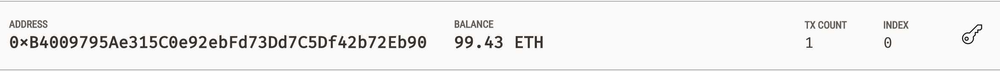
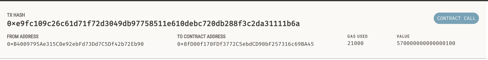

# 19-challenge
Challenge 19 for the Columbia FinTech Bootcamp (Web3.py)

## Technologies
For this challenge I edited existing code to create a streamlit application that allows for transactions on a local Ethereum blockchain run through Ganache. I used the following Python packages, in addition to Ganache, to complete it.

* streamlit
* dataclasses (dataclass)
* typing (Any, List)
* web3 (Web3)

## Data
We were provided with images of laborers for hire, as well as a database of their associated Ethereum addresses, English names, and hourly costs in Ether. 

## Solution
There were three steps to this challenge. 

First, I reviewed the helper functions provided in `crypto_wallet.py` and used Ganache to generate a mnemonic seed phrase to create a HD wallet and associated Ethereum account. 

For step 2, I calculated the total wage per candidate based on their rate and hours worked and created Streamlit functionality for the user to hire a candidate. After the candidate is hired, balloons fill the screen. In my case, I paid Jo for 3 hours of work (0.57 ether)

Lastly, I inspected the transaction and took the following screenshots of my account and transaction info. 

